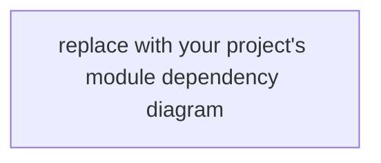

# Project Overview

> **Template.** This file is a placeholder unpacked by `agentlaw init`. After
> bootstrap, replace the placeholder content with your project's own overview.
> The structure below is the recommended shape — keep the section headers,
> fill the body with project-specific content. `agentlaw verify` enforces the
> `Map scope:` block freshness when you populate the Code Architecture Map
> section.

_(fill in after agentlaw init with this project's facts)_

## Purpose

(Describe what this repository is, who uses it, and the single
canonical statement of its goal.)

## Audience

- **Maintainers**: (who maintains this repo and what they own)
- **End users / consumers**: (who depends on this repo and through what
  interface — pip package, library, service endpoint, CLI, etc.)
- **AI coding agents**: read the law layer (`docs/law/*`) and this file
  for orientation; operate through the MCP server or CLI surfaces.

## Project Structure

| Path | Purpose |
| --- | --- |
| `AGENTLAW_CONSTITUTION.md` | highest-authority document |
| `AGENTLAW_*_TOOL.md` | root control procedures (init / update / fix / align) |
| `AGENTS.md` | routing-only entry map (not a rule store) |
| `docs/law/*` | law layer (canonical rules) |
| `docs/contracts/*` | shared boundary contracts |
| `docs/planning-protocol/*` | plan template + review method |
| `docs/plans/{draft,active,completed}/` | plans by lifecycle stage |
| `memory/` | canonical memory (rules, known-facts, logs, working-set) |
| `.harness/` | derived runtime state (gitignored — recreated by `agentlaw init`) |
| `(your project source paths)` | (fill in: e.g. `src/`, `app/`, `lib/`, etc.) |

## Stakeholders & Responsibilities

| Stakeholder | Responsibility |
| --- | --- |
| Maintainer(s) | (fill in) |
| AI agent | reads law before writing; uses MCP memory tools for state |
| End user | (fill in) |

## Code architecture map

```text
Map scope:
  - <glob 1>
  - <glob 2>
```

(After populating `Map scope:` with at least one glob pattern, add the
Mermaid diagrams that describe your code's module boundaries, entry-point
call graphs, and class/data models. The `agentlaw verify` mechanical check
will compare git commit timestamps of files matching `Map scope:` against
this file's timestamp and fail when scoped files become newer without a
corresponding update here.)



## Data / State Model

(Describe the persistent data shape, derived state, and how the two stay
in sync. If your project has database tables, queues, caches, or external
state stores, name them and their canonical-vs-derived classification.)

## Typical Flow

(Describe one or two representative user / agent flows from input to
output. The flow descriptions become the anchor that the architecture
map references.)

## Verification

`agentlaw verify` runs the mechanical checks for this repository.

Run `agentlaw align --check --target .` after adding or removing local
agentlaw laws, root controls, directories, or command surfaces. Use
`agentlaw align --write --target .` only for safe routing updates that the
command marks autofixable, then run `agentlaw verify .`.

(Add project-specific verification commands here — test runners,
linters, build commands, etc.)
